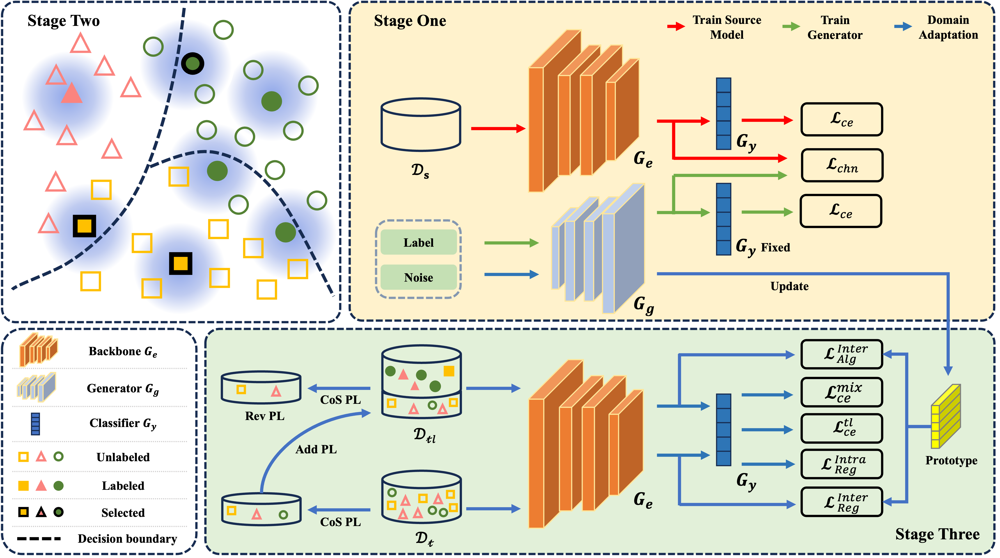

# Source-free Active Domain Adaptation for Diabetic Retinopathy Grading Based on Ultra-wide-field Fundus Image

This code repository includes the source code for the [Source-free Active Domain Adaptation for Diabetic Retinopathy Grading Based on Ultra-wide-field Fundus Image](https://arxiv.org/abs/2309.10619):

# Paper
Domain adaptation (DA) has been widely applied in the diabetic retinopathy (DR) grading of unannotated ultra-wide-field (UWF) fundus images, which can transfer annotated knowledge from labeled color fundus images. However, suffering from huge domain gaps and complex real-world scenarios, the DR grading performance of most mainstream DA is far from that of clinical diagnosis. To tackle this, we propose a novel source-free active domain adaptation (SFADA) in this paper. Specifically, we focus on DR grading problem itself and propose to generate features of color fundus images with continuously evolving relationships of DRs, actively select a few valuable UWF fundus images for labeling with local representation matching, and adapt model on UWF fundus images with DR lesion prototypes. Notably, the SFADA also takes data privacy and computational efficiency into consideration. Extensive experimental results demonstrate that our proposed SFADA achieves state-of-the-art DR grading performance, increasing accuracy by 20.9% and quadratic weighted kappa by 18.63% compared with baseline and reaching 85.36% and 92.38% respectively. These investigations show that the potential of our approach for real clinical practice is promising.

# Training
- First, Prepare your dataset and modify configs
```
./configs/visda.yaml
```
- Second, obtain source model on source domain
```
python main.py
```
- Finally, modify configs and train model on target domain
```
python main.py
```


# Citation
If you find our work useful in your research, please cite the following paper:
```
@article{ran2023source,
  title={Source-free Active Domain Adaptation for Diabetic Retinopathy Grading Based on Ultra-wide-field Fundus Image},
  author={Ran, Jinye and Zhang, Guanghua and Zhang, Ximei and Xie, Juan and Xia, Fan and Zhang, Hao},
  journal={arXiv preprint arXiv:2309.10619},
  year={2023}
}
```
